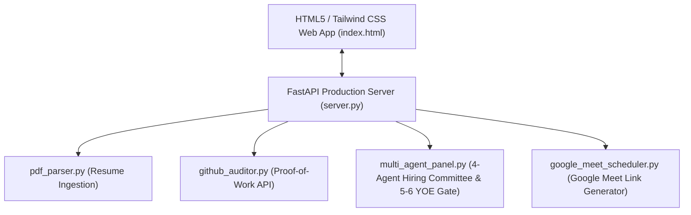

# Zinsiehe ATS Agent | FastAPI & HTML5 / Tailwind CSS Platform

An autonomous, multi-agent Applicant Tracking & Shortlisting System built for **Zinsiehe** (Gen AI & Analytics Consultancy). Powered by **FastAPI**, **HTML5/Tailwind CSS**, **pypdf**, and **GitHub REST API**.

---

## 🌐 Live Cloud Deployment Guide

You can deploy this FastAPI application live to any public cloud platform in **under 2 minutes**:

### Option 1: Deploy on Render (Recommended - Free Web Service)
1. Go to [dashboard.render.com](https://dashboard.render.com/) and click **New +** ➔ **Web Service**.
2. Connect your GitHub repository: `https://github.com/shikhasrivastava0574-afk/ats_hybrid_agent`.
3. Set **Start Command**: `uvicorn server:app --host 0.0.0.0 --port $PORT`
4. Click **Create Web Service**! Render will build and host your app live with an `https://...onrender.com` URL.

### Option 2: Deploy on Railway
1. Go to [railway.app](https://railway.app/) and click **New Project** ➔ **Deploy from GitHub repo**.
2. Select `shikhasrivastava0574-afk/ats_hybrid_agent`.
3. Railway auto-detects `Dockerfile` or `requirements.txt` and deploys your live URL.

### Option 3: Deploy with Docker
```bash
docker build -t zinsiehe-ats-agent .
docker run -p 8000:8000 zinsiehe-ats-agent
```

---

## 🏗️ System Architecture



---

## ⚙️ REST API Endpoints

- `GET /`: Serves the HTML5/Tailwind CSS interactive web dashboard.
- `GET /api/sample_data`: Returns sample candidate profiles & Zinsiehe job descriptions.
- `POST /api/parse_pdf`: Upload PDF resume file and extract text/contact details.
- `POST /api/github_audit`: Audit public GitHub profile repository metrics.
- `POST /api/evaluate`: Execute 4-Agent Hiring Board Debate & Hard 5-6 YOE Experience Gate.
- `POST /api/schedule_meet`: Generate pre-filled Google Calendar & Google Meet video call links.

---

## 🚀 Local Quick Start Guide

```bash
git clone https://github.com/shikhasrivastava0574-afk/ats_hybrid_agent.git
cd ats_hybrid_agent
pip install -r requirements.txt
python3 server.py
```
Open **`http://localhost:8000`** in your browser.

---

## 📄 License
MIT License
